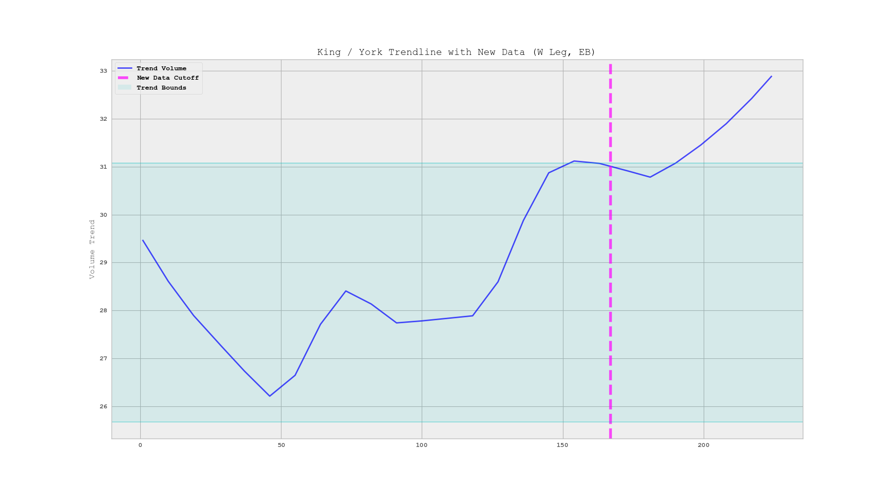
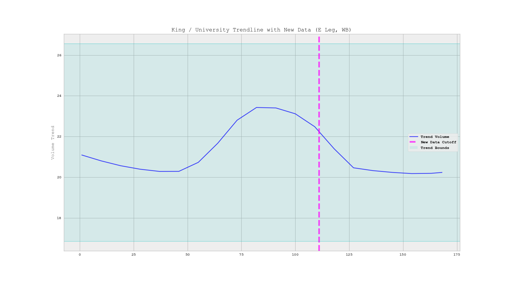
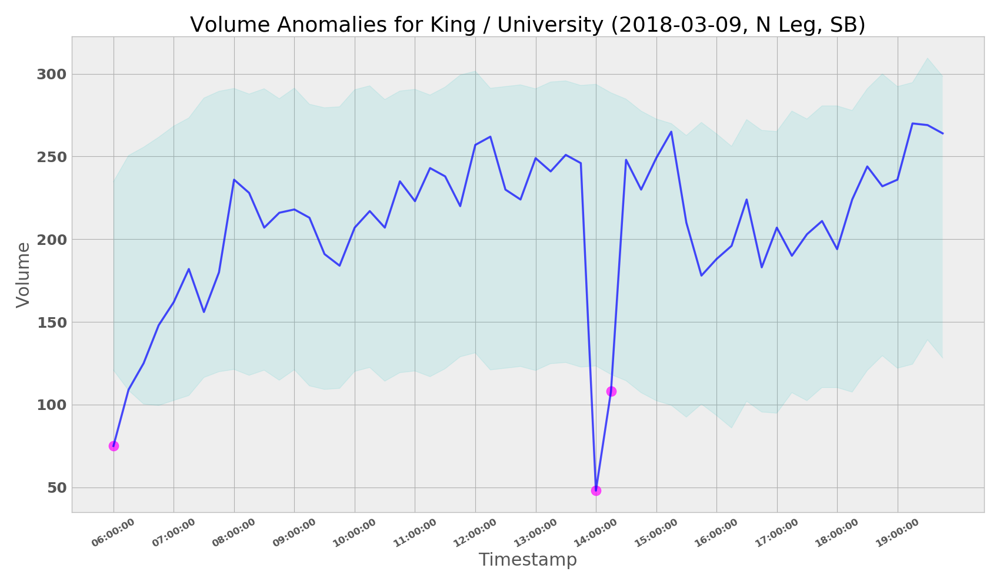
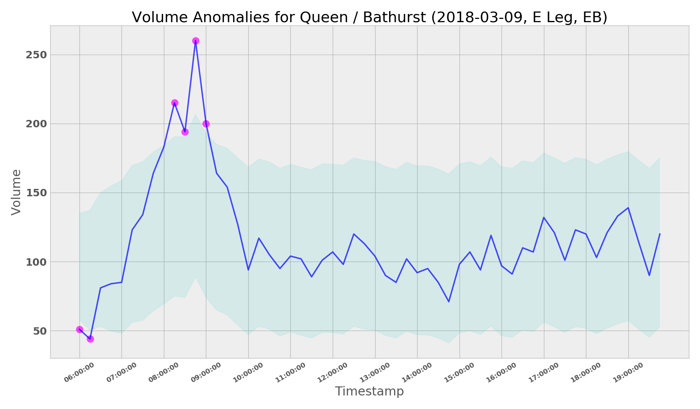
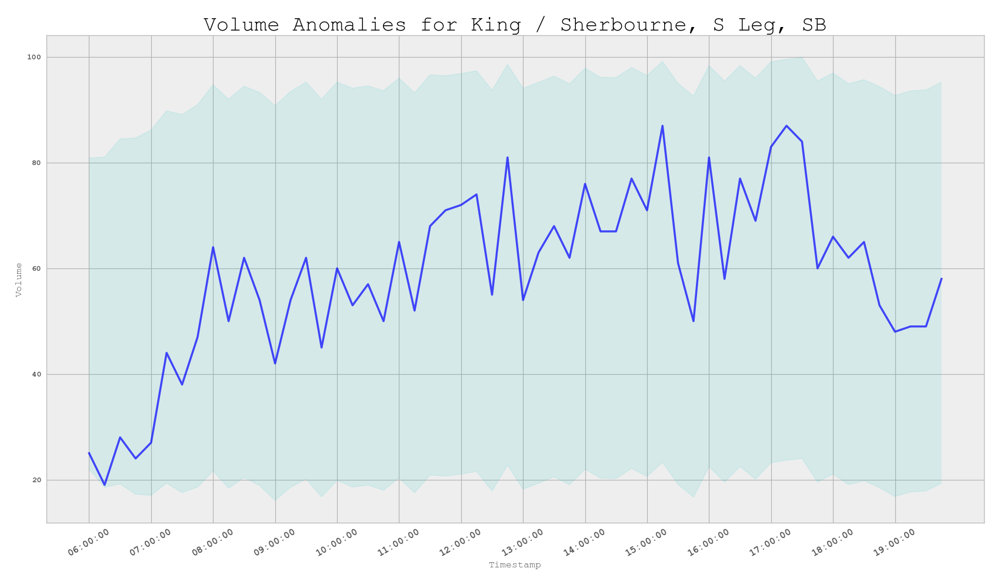

# Anomalous Counts Project

## Overview
The City of Toronto is currently receiving multimodal count data at 30+ in the downtown core. This data will start being ingested into the team's internal database on an daily basis.

The purpose of this project is to build a tool to identify anomalous data for potential investigation as an initial screen for QC.

## Key Questions

**1. Does the data generally look OK?:"** For a specific mode-leg-direction-intersection-date combination, does the data overall appear to be in line with past data?

**2. Are there any strange data points?:** Does any of the more granular data points look completely out of line? If too low, this may be indicative of an incident or road closure. If too high, this may be indicative of a special event. Either way, these should be investigated.

## Decision Points
Prior to implementation, some research and exploratory analysis will be required in order to make decisions on a number of key components of this model.

**1. What Type of Model?:** Given the wide variety of case studies available in the subject area of time series modelling and anomaly detection, there are a number of different approaches that could be implemented for this project. Possible options include ARIMA, Seasonal-trend detection using LOESS (STL), or some clustering-derived metric.

**2. What Level of Granularity?:** What granularity provides the right balance between predictive power (given a larger dataset) and limited noise? Possible options include 15 minutes, 30 minutes, or 1 hour.

**3. How Should Days be Grouped?:** What groupings should be used to categorize weekdays together for comparison? Should two seperate categories be created for weekdays (e.g. Mon-Wed, Thu-Fri)? Should each weekday be treated seperately? What about weekends? Should this decision be made individually for each intersection or treated as a general rule across all intersections? And if the former, can this decision be automated?

## Implemented Solution

The solution was implemented as a two pronged approach. 

**1. 15 Minute Single Value Anomaly Detection**

   To detect 15 minute individual anomalies, an foreacsting prediction error approach was chosen. 

   Essentially, given new data with a particular day of week, intersection, direction, and leg combination, all historical data with the same attributes are retrieved from miovision schema. An appropriate forecasting model is fitted to this data, either STL ETS (Error, Trend Seasonality Model) or an ARIMA model. R selects either of these models based on its own parameters. Generally speaking, ETS is much more flexible. A 24 hour prediction interval of historic data is conseqeuntly produced, and if the new data lays outside this prediction interval, it is flagged. 

**2. Trend Deviation Detection** 

  In order to detect overall trend deviations from historic data, STL decomposition was used. In a similar way to 15 minute detection, historical data is retrieved given a combination of attributes. The data is decomposed, and the trend component of the data is isolated. The new data is appended to the historic trend. We detect deviant new trends through the classic Box-Plot outlier detection method, i.e. given a trend point x, x must lie within  

   
  
   To not be considered an anomaly. 
   
Note that the days were grouped on an individual day of week group basis, i.e. Fridays were grouped together, Mondays were grouped together, etc. This is due to the fact that the variance between days is high, and the overall trend behaviour of individual day groups is relatively continuous and constant.  

## Relevant Packages and Documentation 

The primary package used for for this project was the `forecast` package in R. This package contained the necessary functions used to detect 15 minute single anomalies. It can be found [here](https://cran.r-project.org/web/packages/forecast/index.html).

The `stl` function in R was used to decompose historic data. Info about this function can be found [here](https://stat.ethz.ch/R-manual/R-devel/library/stats/html/stl.html). 

Some explanation of the math underlying appropriate ARIMA model selection can be found [here](https://people.duke.edu/~rnau/arimrule.htm)

## Relevant Notebooks 

* [anomaly_detection.py](https://github.com/CityofToronto/bdit_anomalous_counts/blob/master/notebooks/anomaly_detection.py) is the primary script used for anomaly detection.

* [anomaly_detection_analysis.ipynb](https://github.com/CityofToronto/bdit_anomalous_counts/blob/master/notebooks/anomaly_detection_analysis.ipynb) contains the exploratory analysis that led to the development of relevation functions in the `anomaly_detection.py` script. Moreover, it contains some of the motivation behind the intution and mathematics of the functions developed. 

* [approaches.ipynb](https://github.com/CityofToronto/bdit_anomalous_counts/blob/master/notebooks/approaches.ipynb) highlights some of the other approaches that could have been taken with this project. 

* [adbath_exploratory.ipynb](https://github.com/CityofToronto/bdit_anomalous_counts/blob/master/notebooks/adbath_exploratory.ipynb) and [adbath_daygroup.ipynb](https://github.com/CityofToronto/bdit_anomalous_counts/blob/master/notebooks/adbath_daygroup%20.ipynb) contain very rough exploratory preliminary analyses of Adelaide and Bathurst anomalies. 

## Examples of Anomalies and Trend Deviations

 

Here is an example of an evident trend deviation. You can see that after the data cutoff, the trend surpasses the upper bound.

Here is an example of no trend deviation. You can see that the new data lies within the bounds. 

Here is an example of a valid anomaly. Look at the two data points at 14:00 and 14:15. There is a clear sharp trough at these times. These constitute valid anomalies as they lie outside the lower bound. 

Here is another example of valid anomalies, seen from 8:00 AM to 9:00 AM. 

 

Here is an example of no anomalies. The new data sits within the prediction bounds.

# How to use `anomaly_detection.py`

1. A `db.cfg` file can be located in this repository's `notebooks` folder. Fill in your credentials in this cfg file and download this file. At the top of `anomaly_detection.py`, substitue the location of your downloaded `db.cfg` file as the input of the `CONFIG.read` function. 

2. If you wish to change the bounds of 15 minute anomaly detection:

      i. Proceed to the end of the file, within the `for` loop. 
      
      ii. The function `anomalous` accepts a percentile value as its last parameter. This value is a percentage prediction interval region for the ARIMA/ETS forecast. 
      
      iii. The value is currently set at `98` %. Change this value to your preference. The default value in R is `95`. 

3. If you wish to change the bounds of trend deviation detection:

      i. Proceed to the end of the file, within the `for` loop. 
      
      ii. The function `trend` accepts a numeric value as its last parameter, which is the multiplicative IQR factor that determines the upper and lower bounds for trend deviation. The spread is calculated through the classical box plot method of outlier detection. 
      
    iii. The default is `2`. The larger the value, the greater the bounds. In traditional statistical outlier detection, this value is 1.5 Change this value to your preference. 

4. Run `anomaly_detection.py` from your command line. 

